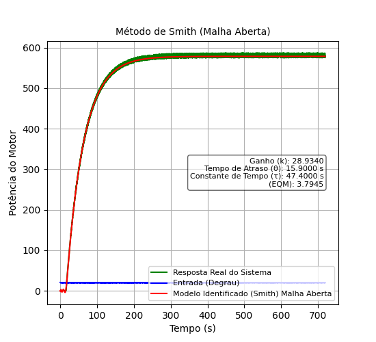
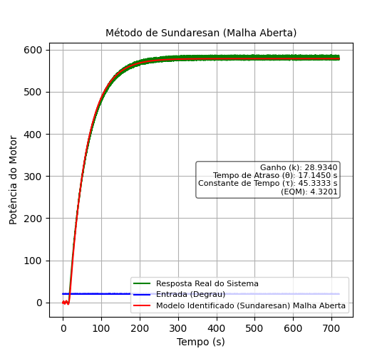
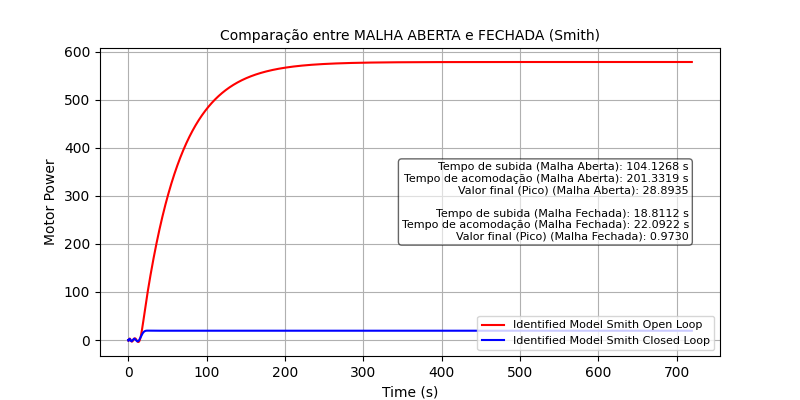
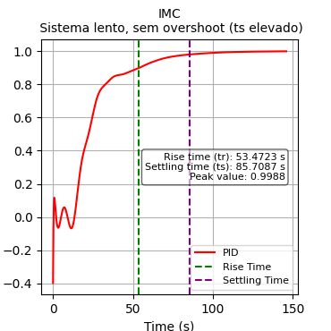
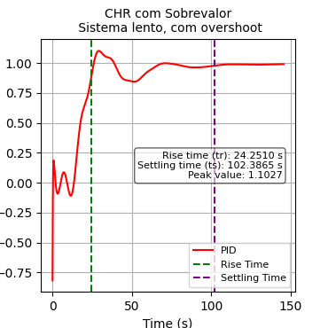
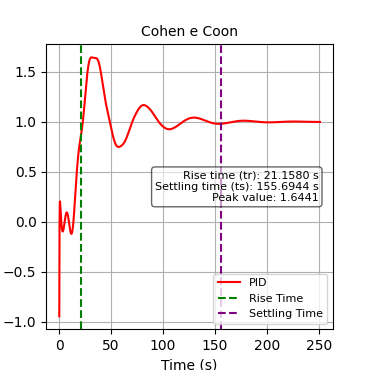

# Projeto prático Sistemas Embarcados - C213

### Controle de Velocidade de Motor com Atraso de Propagação
O projeto busca criar um sistema de controle para ajustar a velocidade de um motor em uma esteira industrial, garantindo eficiência e segurança.
O principal desafio é o atraso de propagação dos sinais de controle, que pode gerar instabilidade e oscilações indesejadas na velocidade, afetando a precisão do sistema.

### Team
 - Victor Boaventura - 1807 - GEC
 - Yves Ribeiro - 1792 - GEC

## Pré requisitos 
Para efetivamente executar o projeto, é necessário instalar algumas bibliotecas em python.

```sh
    pip install customtkinter tkinter matplotlib scipy numpy control 
```

## Arquivos do projeto 
- `sys_identification.py` é a função responsável por identificar os parâmetros do PID usando o Smith ou Sundarsan
- `method_smith.py`função que utiliza o método de Smith para modelar um sistema de controle de motor em malha aberta ou fechada.
- `method_sundaresan.py` função que utiliza o método de Sundaresan para modelar um sistema de controle de motor em malha aberta ou fechada.
- `pid_controller.py` é a função responsável por utilizar os diversos controladores, possibilitando a utilização de qualquer um pelo usuário
- `main.py` arquivo que configura toda a interface e fluxo de interação entre as funções acima, automatizando grande parte do sistema de identificação de controle.

## Método Smith
A imagem abaixo apresenta a resposta ao degrau obtida pela identificação pelo métodos de Smith e suas funções de transferência.



## Método Sundaresan
A imagem abaixo apresenta a resposta ao degrau obtida pela identificação pelo métodos de Sundaresan e suas funções de transferência.



## Comparação entre malha (aberta e fechada) do método definido
Para o nosso dataset (Dataset_Grupo4.mat), o melhor método definido foi o Smith, por possuir um menor EQM. A imagem abaixo representa a comparação entre a malha aberta e fechada obitidas através desse método.



# Controladores PID
Foram definidos 2 controladores para cada grupo utilizar, o nossos eram: IMC e CHR com Sobrevalor. Aproveitamos a implementação do restante dos controladores para adicionar o resultado de um terceiro também.

## IMC
Controlador PID de acordo com o método IMC



## CHR com Sobrevalor
Controlador PID de acordo com o método CHR com Sobrevalor



## Cohen e Coon
Controlador PID de acordo com o método Cohen e Coon




